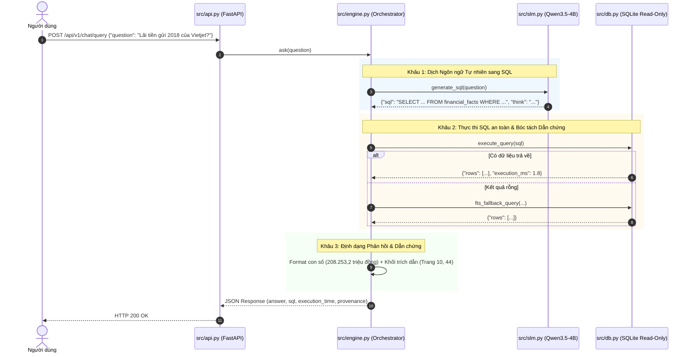

# ĐẶC TẢ CẤU TRÚC DỰ ÁN & KIẾN TRÚC MÃ NGUỒN (PROJECT STRUCTURE & SOFTWARE BLUEPRINT)

> **Tài liệu**: `docs/PROJECT_STRUCTURE.md`  
> **Trạng thái**: `[BẢN VẼ MỤC TIÊU / TARGET BLUEPRINT]`  
> **Nguyên tắc cốt lõi**: Tuân thủ quy trình **Spec-First / Doc-Driven Development**, tiêu chuẩn kỹ thuật tối giản **Ponytail** (Ưu tiên Standard Library, hạn chế tối đa thư viện bên ngoài, không vẽ thêm tầng trừu tượng dư thừa).

---

## 1. TỔNG QUAN TRIẾT LÝ KIẾN TRÚC MÃ NGUỒN

Hệ thống được thiết kế theo mô hình **End-to-End Deterministic Pipeline**:
1. **Zero-Overhead & Simplicity**: Không dùng LangChain, LlamaIndex hay các framework trừu tượng phức tạp. Tự xây dựng luồng xử lý bằng Python thuần (Standard Library) để kiểm soát 100% logic, độ trễ và khả năng debug.
2. **Modular Independence**: Mỗi module đảm nhận duy nhất một trách nhiệm (Single Responsibility Principle - SRP):
   * `db.py`: Chỉ lo việc kết nối và truy vấn CSDL SQLite an toàn.
   * `slm.py`: Chỉ lo việc kết nối với mô hình ngôn ngữ nhỏ Qwen3.5-4B.
   * `engine.py`: Bộ điều phối trung tâm (Orchestrator) kết nối `slm` và `db`.
   * `api.py`: Tầng cổng giao tiếp REST API (FastAPI).
   * `analytics.py`: Tầng tính toán định lượng chuyên sâu (Z-Score, F-Score, DuPont).
3. **Traceability First**: Mọi kết quả số liệu đi qua hệ thống đều phải giữ nguyên trường truy vết kiểm toán (`source_doc`, `page_no`, `statement`, `raw_value`).

---

## 2. CÂY THƯ MỤC CHUẨN HÓA (DIRECTORY TAXONOMY)

```
AI_Financial/
│
├── .agents/                                  # Cấu hình Antigravity Agent & Skill
│   ├── rules/
│   │   └── doc-driven-development.md         # Quy tắc bắt buộc: Viết Docs trước khi Code
│   └── skills/
│       └── system-evaluator/                 # Bộ công cụ thẩm định đối chiếu chéo 4 đỉnh
│           ├── SKILL.md
│           └── scripts/
│               └── audit_engine.py           # Engine kiểm tra CSDL và Benchmark tự động
│
├── data/                                     # Dữ liệu phục vụ hệ thống
│   ├── code_stock.csv                        # Danh mục 100 mã cổ phiếu & tên công ty
│   ├── financial.db                          # CSDL SQLite Native (2.116.243 facts, B-Tree + FTS5)
│   ├── financial_statements/                 # 1.973 tệp BCTC OCR thô (*_extracted.txt)
│   └── questions/
│       └── questions.jsonl                   # 1.012 câu hỏi benchmark thực tế kèm metadata
│
├── docs/                                     # Tài liệu đặc tả kiến trúc (Target Ground Truth)
│   ├── ARCHITECTURE.md                       # Master doc: Tầng dữ liệu, ETL & CSDL
│   ├── INFERENCE_ARCHITECTURE.md             # Tầng suy luận: Text-to-SQL & Analytics Engine
│   └── PROJECT_STRUCTURE.md                  # Tài liệu này: Cấu trúc thư mục & mã nguồn
│
├── scripts/                                  # Các kịch bản chạy lô (Batch Jobs & Utilities)
│   ├── build_db.py                           # Pipeline ETL nạp 2.1M facts vào SQLite
│   └── run_benchmark.py                      # Chạy đánh giá độ chính xác trên 1.012 câu hỏi
│
├── src/                                      # Mã nguồn chính của ứng dụng (Application Core)
│   ├── __init__.py
│   ├── config.py                             # Cấu hình tập trung (Đường dẫn, Model, Port, Timeout)
│   ├── db.py                                 # SQLite Native Database Client (Read-Only, Safe Execution)
│   ├── slm.py                                # Client giao tiếp với Qwen3.5-4B-SQL qua Ollama/API
│   ├── engine.py                             # Core Orchestrator: Luồng xử lý Hỏi - Đáp hoàn chỉnh
│   ├── analytics.py                          # [Mở rộng] Công thức tính Z-Score, F-Score, DuPont, Dự báo
│   └── api.py                                # REST API Server (FastAPI theo chuẩn §3)
│
├── tests/                                    # Kiểm thử tự động (Unit & Integration Tests)
│   ├── test_db.py                            # Kiểm thử kết nối, quyền đọc, và truy vấn FTS5
│   ├── test_slm.py                           # Kiểm thử sinh SQL từ mô hình SLM
│   ├── test_engine.py                        # Kiểm thử luồng E2E Hỏi - Đáp trên câu hỏi mẫu
│   └── test_analytics.py                     # Kiểm thử công thức toán tài chính
│
├── GEMINI.md                                 # Chỉ dẫn dự án & các quy tắc bất biến
└── requirements.txt                          # Danh mục phụ thuộc (Tối giản: FastAPI, Uvicorn, Requests)
```

---

## 3. CHI TIẾT TRÁCH NHIỆM & CONTRACT TỪNG MODULE TRONG `src/`

### 3.1. `src/config.py` (Cấu hình hệ thống)
* **Nhiệm vụ**: Quản lý tập trung toàn bộ biến môi trường, đường dẫn tệp và tham số mô hình.
* **Các hằng số bắt buộc**:
  * `DB_PATH`: Đường dẫn tới `data/financial.db`.
  * `CODE_STOCK_PATH`: Đường dẫn tới `data/code_stock.csv`.
  * `OLLAMA_BASE_URL`: Địa chỉ máy chủ Ollama (mặc định: `http://localhost:11434`).
  * `SLM_MODEL_NAME`: Tên mô hình (mặc định: `giangkh19/qwen3.5-4b-sql-gguf:Q4_K_M` hoặc bản Ollama tương đương).
  * `API_HOST`, `API_PORT`: Địa chỉ phục vụ FastAPI (mặc định: `0.0.0.0:8000`).

---

### 3.2. `src/db.py` (Quản lý Truy vấn CSDL An toàn)
* **Nhiệm vụ**: Kết nối CSDL SQLite ở chế độ **Read-Only tuyệt đối**, thực thi câu lệnh SQL và trích xuất kết quả kèm dẫn chứng kiểm toán (Provenance).
* **Các hàm cốt lõi**:
  * `get_connection()`: Mở kết nối `sqlite3` với URI `file:data/financial.db?mode=ro`.
  * `execute_query(sql_query: str) -> dict`:
    * Kiểm tra an toàn (Safety Check): Chặn các từ khóa nguy hiểm (`DROP`, `INSERT`, `UPDATE`, `DELETE`, `ALTER`).
    * Thực thi truy vấn với timeout (giới hạn 3 giây).
    * Bổ sung `LIMIT 10` tự động nếu câu lệnh chưa có LIMIT và không phải là hàm gộp (`COUNT`, `SUM`).
  * `fts_fallback_query(ticker, year, keyword) -> list`:
    * Tự động tìm kiếm qua bảng ảo `facts_fts` khi câu truy vấn SQL ban đầu trả về rỗng do sai lệch ký tự.
  * `extract_provenance(rows: list) -> list`:
    * Bóc tách thông tin: `ticker`, `company_name`, `source_doc`, `page_no`, `statement`, `raw_value`.

---

### 3.3. `src/slm.py` (Giao tiếp với Mô hình Qwen3.5-4B-SQL)
* **Nhiệm vụ**: Đóng gói Prompt chuẩn 15 cột, gọi mô hình SLM cục bộ và bóc tách câu lệnh SQL ANSI sạch từ phản hồi.
* **Các hàm cốt lõi**:
  * `build_prompt(question: str) -> str`:
    * Chèn schema bảng `financial_facts` (15 cột nghiệp vụ).
    * Chèn quy tắc đơn vị tiền tệ và quy tắc loại trừ USD theo đúng tài liệu `docs/INFERENCE_ARCHITECTURE.md`.
  * `generate_sql(question: str) -> dict`:
    * Gửi request tới Ollama `/api/generate` với `temperature=0.0`.
    * Bóc tách thẻ suy luận nội tại `<think> ... </think>` (lưu lại chuỗi suy luận để giải trình nếu cần).
    * Trích xuất khối mã SQL sạch (`SELECT ...`).

---

### 3.4. `src/engine.py` (Core Orchestrator - Trái tim hệ thống)
* **Nhiệm vụ**: Kết nối `slm.py` và `db.py` thành một luồng hoàn chỉnh từ lúc nhận câu hỏi tiếng Việt đến khi trả lời.
* **Luồng xử lý hàm `ask(question: str) -> dict`**:
  1. Tiền xử lý: Tra cứu Ticker từ `code_stock.csv` để chuẩn hóa nếu câu hỏi dùng tên công ty.
  2. Gọi `slm.generate_sql(question)` $\rightarrow$ Nhận câu lệnh SQL và reasoning `<think>`.
  3. Gọi `db.execute_query(sql)` $\rightarrow$ Nhận danh sách bản ghi và dữ liệu kiểm toán.
  4. Nếu kết quả rỗng $\rightarrow$ Kích hoạt `db.fts_fallback_query` để cứu dữ liệu.
  5. Định dạng câu trả lời văn phong tự nhiên (Natural Language Answer) kèm con số chuẩn (Tỷ/Triệu VNĐ) và khối trích dẫn kiểm toán Provenance.

---

### 3.5. `src/analytics.py` (Module Phân tích & Dự báo Định lượng)
* **Nhiệm vụ**: Chứa các thuật toán toán học tài chính độc lập, nhận dữ liệu số từ `db.py` để tính toán chỉ số.
* **Các hàm cốt lõi**:
  * `get_altman_z_score(ticker: str, year: int) -> dict`: Tính 5 hệ số $X_1 \dots X_5$, trả về điểm Z và vùng phân định.
  * `get_piotroski_f_score(ticker: str, year: int) -> dict`: Đánh giá 9 tiêu chí nhị phân giữa năm $T$ và $T-1$.
  * `get_dupont_analysis(ticker: str, year: int) -> dict`: Phân rã ROE theo mô hình 3 bước.
  * `get_time_series_forecast(ticker: str, indicator: str, horizon: int) -> dict`: Tính CAGR và dự báo OLS kèm khoảng tin cậy 95%.

---

### 3.6. `src/api.py` (FastAPI Web Service)
* **Nhiệm vụ**: Cung cấp giao diện HTTP REST API phục vụ cho giao diện Web/Chatbot theo đúng hợp đồng đã công bố ở `docs/INFERENCE_ARCHITECTURE.md §3`.
* **Endpoints**:
  * `POST /api/v1/chat/query`: Luồng hỏi đáp Text-to-SQL chính.
  * `POST /api/v1/analytics/diagnostics`: Trả về Z-Score, F-Score, DuPont.
  * `POST /api/v1/analytics/forecast`: Trả về dự báo chuỗi thời gian.
  * `GET /api/v1/health`: Kiểm tra trạng thái CSDL và Model.

---

## 4. LUỒNG DỮ LIỆU ĐIỀU PHỐI (END-TO-END EXECUTION FLOW)



---

## 5. QUY TRÌNH PHÁT TRIỂN & NGHIỆM THU TỪNG BƯỚC

Mỗi module khi code sẽ đi qua đúng 4 nhịp:
1. **Làm (Implement)**: Viết mã nguồn tối giản trong `src/`.
2. **Review (Kiểm thử độc lập)**: Viết bài test tương ứng trong `tests/` và chạy lệnh verify.
3. **Fix (Sửa lỗi nếu có)**: Khắc phục các ca biên (edge cases).
4. **Done (Nghiệm thu)**: Commit mã nguồn và chuyển sang module tiếp theo.
